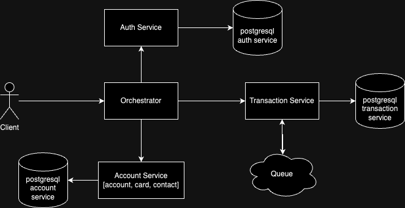

# API Design

## User API

### User Properties

#### Users

| No. | Name          | Data Type | Description               |
|-----|---------------|-----------|---------------------------|
| 1.  | user_id       | UUID      | User ID                   |
| 2.  | name          | String    | User name                 |
| 3.  | identity_card | String    | User identity card        |
| 4.  | email         | String    | User email                |
| 5.  | phone         | String    | User phone                |
| 6.  | password      | String    | [Encrypted] User password |
| 7.  | pin           | String    | [Encrypted] User PIN      |
| 8.  | is_verified   | Boolean   | Is verified user          |
| 9.  | created_at    | Timestamp | Time user created         |
| 10. | updated_at    | Timestamp | Time user last updated    |
| 11. | deleted_at    | Timestamp | Time user deleted         |

### Register new user

`[POST] /api/v1/user/register`

#### Request

| No. | Name          | Required | Data Type | Description        |
|-----|---------------|----------|-----------|--------------------|
| 1.  | name          | TRUE     | String    | User name          |
| 2.  | identity_card | TRUE     | String    | User identity card |
| 3.  | email         | TRUE     | String    | User email         |
| 4.  | phone         | TRUE     | String    | User phone         |

```json
{
  "name": "name",
  "identity_card": "1234567890123456",
  "email": "name@gmail.com",
  "phone": "081234567890"
}
```

#### Response

```json
{
  "data": {
    "user_id": "",
    "name": "name",
    "identity_card": "1234567890123456",
    "email": "name@gmail.com",
    "phone": "081234567890"
  },
  "error_code": "",
  "message": ""
}
```

#### Error Codes

| No. | Name   | HTTP Status | Description   |
|-----|--------|-------------|---------------|
| 1.  | USR000 | 500         | Unknown error |
| 2.  | USR002 | 400         | Bad request   |

### Validate registered user (validate via dukcapil and create account if valid)

`[POST] /api/v1/user/validate/{user_id}`

#### Request

| No. | Name          | Required | Data Type           | Description              |
|-----|---------------|----------|---------------------|--------------------------|
| 1.  | user_id       | TRUE     | String              | User ID                  |
| 2.  | identity_card | TRUE     | Multipart/form-data | User identity card image |

```json
{
  "name": "name",
  "identity_card": "multipart/form-data"
}
```

#### Response

```json
{
  "data": {
    "user_id": "",
    "name": "name",
    "identity_card": "1234567890123456",
    "email": "name@gmail.com",
    "phone": "081234567890",
    "is_verified": true,
    "account": {
      "account_id": "",
      "account_number": "0000 0000 0000",
      "balance": 0,
      "card": {
        "card_id": "",
        "card_number": "0000 0000 0000 0000",
        "expiry": "02/27",
        "is_active": true
      }
    }
  },
  "error_code": "",
  "message": ""
}
```

#### Error Codes

| No. | Name   | HTTP Status | Description   |
|-----|--------|-------------|---------------|
| 1.  | USR000 | 500         | Unknown error |
| 2.  | USR002 | 400         | Bad request   |

### Login user

`[POST] /api/v1/user/login`

#### Request

| No. | Name     | Required | Data Type | Description   |
|-----|----------|----------|-----------|---------------|
| 1.  | email    | TRUE     | String    | User email    |
| 2.  | password | TRUE     | String    | User password |
| 3.  | pin      | TRUE     | String    | User pin      |

```json
{
  "email": "name@gmail.com",
  "password": "",
  "pin": ""
}
```

#### Response

```json
{
  "data": {
    "access_token": "",
    "refresh_token": "",
    "expiry": ""
  },
  "error_code": "",
  "message": ""
}
```

#### Error codes

| No. | Name   | HTTP Status | Description   |
|-----|--------|-------------|---------------|
| 1.  | USR000 | 500         | Unknown error |
| 2.  | USR001 | 401         | Unauthorized  |

## Account API

### Account Properties

#### Accounts

| No. | Name           | Data Type | Description               |
|-----|----------------|-----------|---------------------------|
| 1.  | account_id     | UUID      | Account ID                |
| 2.  | fk_user        | UUID      | Foreign key of user       |
| 3.  | account_number | String    | Account number            |
| 4.  | balance        | Float64   | Balance of the account    |
| 5.  | created_at     | Timestamp | Time account created      |
| 6.  | updated_at     | Timestamp | Time account last updated |
| 7.  | deleted_at     | Timestamp | Time account deleted      |

#### Cards

| No. | Name        | Data Type | Description               |
|-----|-------------|-----------|---------------------------|
| 1.  | card_id     | UUID      | Card ID                   |
| 2.  | fk_account  | UUID      | Foreign key of account    |
| 3.  | card_number | String    | Card number               |
| 4.  | expiry      | String    | Expiry card               |
| 5.  | is_active   | Boolean   | Active status of the card |
| 6.  | created_at  | Timestamp | Time account created      |
| 7.  | updated_at  | Timestamp | Time account last updated |
| 8.  | deleted_at  | Timestamp | Time account deleted      |

### Get account

`[GET] /api/v1/account`

#### Request

Authorization: Bearer token

#### Response

```json
{
  "data": {
    "account_id": "",
    "account_number": "0000 0000 0000",
    "balance": 123,
    "card": {
      "card_id": "",
      "card_number": "0000 0000 0000 0000",
      "expiry": "02/27",
      "is_active": true
    }
  },
  "error_code": "",
  "message": ""
}
```

#### Error Codes

| No. | Name   | HTTP Status | Description   |
|-----|--------|-------------|---------------|
| 1.  | ACC000 | 500         | Unknown error |
| 2.  | USR001 | 401         | Unauthorized  |

### Create new card

`[POST] /api/v1/account/card`

#### Request

Authorization: Bearer token

#### Response

```json
{
  "data": {
    "card_id": "",
    "card_number": "0000 0000 0000 0000",
    "expiry": "02/27"
  },
  "error_code": "",
  "message": ""
}
```

#### Error Codes

| No. | Name   | HTTP Status | Description             |
|-----|--------|-------------|-------------------------|
| 1.  | ACC000 | 500         | Unknown error           |
| 2.  | USR001 | 401         | Unauthorized            |
| 3.  | ACC100 | 400         | There is an active card |

### Deactivate card

`[POST] /api/v1/account/card/deactivate`

#### Request

Authorization: Bearer token

| No. | Name    | Required | Data Type | Description                          |
|-----|---------|----------|-----------|--------------------------------------|
| 1.  | card_id | TRUE     | Integer   | Card ID that wants to be deactivated |

#### Response

```json
{
  "data": {
    "card_id": "",
    "deleted_at": "2023-12-31 00:00:00"
  },
  "error_code": "",
  "message": ""
}
```

#### Error Codes

| No. | Name   | HTTP Status | Description     |
|-----|--------|-------------|-----------------|
| 1.  | ACC000 | 500         | Unknown error   |
| 2.  | USR001 | 401         | Unauthorized    |
| 3.  | ACC200 | 400         | Invalid card ID |

## Contact API

### Contact Properties

#### Contacts

| No. | Name           | Data Type | Description               |
|-----|----------------|-----------|---------------------------|
| 1.  | contact_id     | UUID      | Contact ID                |
| 2.  | account_number | String    | Contact account number    |
| 3.  | bank_id        | UUID      | Bank contact ID           |
| 4.  | contact_name   | String    | Contact name              |
| 5.  | created_at     | Timestamp | Time Contact created      |
| 6.  | updated_at     | Timestamp | Time Contact last updated |
| 7.  | deleted_at     | Timestamp | Time Contact deleted      |

### Get contact list

`[GET] /api/v1/contacts`

#### Request

Authorization: Bearer token

| No. | Name   | Required | Data Type | Description                              |
|-----|--------|----------|-----------|------------------------------------------|
| 1.  | page   | FALSE    | Integer   | Page of contacts (Default 1)             |
| 2.  | limit  | FALSE    | Integer   | Limit item to retrieve (Default 20)      |
| 3.  | search | FALSE    | String    | Search by account number or contact name |

#### Response

```json
{
  "data": {
    "contacts": [
      {
        "contact_id": "",
        "account_number": "000 000 000",
        "bank_id": "BCA",
        "contact_name": "name",
        "created_at": "2023-12-31 00:00:00",
        "updated_at": "2023-12-31 00:00:00",
        "deleted_at": null
      }
    ],
    "page": 1,
    "limit": 20,
    "total": 100,
    "last": false
  },
  "error_code": "",
  "message": ""
}
```

```json
{
  "data": null,
  "error_code": "",
  "message": ""
}
```

#### Error Codes

| No. | Name   | HTTP Status | Description   |
|-----|--------|-------------|---------------|
| 1.  | CNT000 | 500         | Unknown error |
| 2.  | USR001 | 401         | Unauthorized  |

### Get contact by ID

`[GET] /api/v1/contact/{contact_id}`

#### Request

Authorization: Bearer token

| No. | Name       | Required | Data Type | Description          |
|-----|------------|----------|-----------|----------------------|
| 1.  | contact_id | TRUE     | UUID      | Search by contact id |

#### Response

```json
{
  "data": {
    "contact_id": "",
    "account_number": "000 000 000",
    "bank_id": "BCA",
    "contact_name": "name",
    "created_at": "2023-12-31 00:00:00",
    "updated_at": "2023-12-31 00:00:00",
    "deleted_at": null
  },
  "error_code": "",
  "message": ""
}
```

```json
{
  "data": null,
  "error_code": "",
  "message": ""
}
```

#### Error Codes

| No. | Name   | HTTP Status | Description       |
|-----|--------|-------------|-------------------|
| 1.  | CNT000 | 500         | Unknown error     |
| 2.  | USR001 | 401         | Unauthorized      |
| 3.  | CNT200 | 404         | Contact not found |

### Create contact

`[POST] /api/v1/contact`

#### Request

Authorization: Bearer token

| No. | Name           | Required | Data Type | Description                                                                |
|-----|----------------|----------|-----------|----------------------------------------------------------------------------|
| 1.  | account_number | TRUE     | String    | Account number                                                             |
| 2.  | bank_id        | TRUE     | String    | Bank ID                                                                    |
| 3.  | contact_name   | FALSE    | String    | Contact name (optional). Will use response from external bank API if empty |

```json
{
  "account_number": "000 000 000",
  "bank_id": "BCA",
  "contact_name": "name"
}
```

#### Response

```json
{
  "data": {
    "contact_id": "",
    "account_number": "000 000 000",
    "bank_id": "BCA",
    "contact_name": "name",
    "created_at": "2023-12-31 00:00:00",
    "updated_at": "2023-12-31 00:00:00",
    "deleted_at": null
  },
  "error_code": "",
  "message": ""
}
```

```json
{
  "data": null,
  "error_code": "",
  "message": ""
}
```

#### Error Codes

| No. | Name   | HTTP Status | Description                                  |
|-----|--------|-------------|----------------------------------------------|
| 1.  | CNT000 | 500         | Unknown error                                |
| 2.  | USR001 | 401         | Unauthorized                                 |
| 3.  | CNT300 | 400         | Contact not registered in the requested bank |

### Delete Contact

`[DELETE] /api/v1/contact/{contact_id}`

#### Request

Authorization: Bearer token

| No. | Name       | Type | Required | Data Type | Description          |
|-----|------------|------|----------|-----------|----------------------|
| 1.  | contact_id | Path | TRUE     | UUID      | Contact ID to delete |

```json
{
  "contact_id": ""
}
```

#### Response

```json
{
  "data": null,
  "error_code": "",
  "message": ""
}
```

```json
{
  "data": null,
  "error_code": "",
  "message": ""
}
```

#### Error Codes

| No. | Name   | HTTP Status | Description       |
|-----|--------|-------------|-------------------|
| 1.  | CNT000 | 500         | Unknown error     |
| 2.  | USR001 | 401         | Unauthorized      |
| 3.  | CNT400 | 400         | Contact not found |

## Transaction API

### Transaction Properties

#### Transactions

| No. | Name                    | Data Type | Description                                |
|-----|-------------------------|-----------|--------------------------------------------|
| 1.  | transaction_id          | UUID      | Transcation ID                             |
| 2.  | sender_account_number   | String    | Sender account number                      |
| 3.  | receiver_account_number | String    | Receiver account number                    |
| 4.  | receiver_bank_id        | String    | Receiver bank ID                           |
| 5.  | amount                  | Integer   | Amount to transfer                         |
| 6.  | description             | String    | Description of the transaction             |
| 7.  | status                  | String    | Status of the transaction                  |
| 8.  | transfered_at           | Timestamp | Time transaction transfered to sender bank |
| 9.  | created_at              | Timestamp | Time transaction created                   |
| 10. | updated_at              | Timestamp | Time transaction last updated              |
| 11. | deleted_at              | Timestamp | Time transaction deleted                   |

### Initiate transaction

`[POST] /api/v1/transaction`

#### Request

Authorization: Bearer token

| No. | Name           | Required | Data Type | Description                     |
|-----|----------------|----------|-----------|---------------------------------|
| 1.  | account_number | TRUE     | String    | Account number receiver         |
| 2.  | bank_id        | TRUE     | String    | Bank receiver                   |
| 3.  | amount         | TRUE     | Integer   | Bank ID                         |
| 4.  | description    | FALSE    | String    | Description of the transaction  |
| 5.  | pin            | TRUE     | String    | To validate request transaction |

```json
{
  "account_number": "000 000 000",
  "bank_id": "BCA",
  "amount": "100000",
  "description": "",
  "pin": ""
}
```

#### Response
```json
{
  "transaction_id": "uuid",
  "status": "Pending"
}
```

#### Error Codes

| No. | Name   | HTTP Status | Description                           |
|-----|--------|-------------|---------------------------------------|
| 1.  | TRS000 | 500         | Unknown error                         |
| 2.  | USR001 | 401         | Unauthorized                          |
| 3.  | TRS001 | 400         | Bad requet : insufficient amount      |
| 4.  | TRS002 | 400         | Bad requet : invalid receiver account |

### Check transaction status

`[GET] /api/v1/transaction/{transactionID}`

#### Request

Authorization: Bearer token

| No. | Name          | Required | Data Type | Description    |
|-----|---------------|----------|-----------|----------------|
| 1.  | transactionID | TRUE     | String    | Transaction ID |

#### Response

```json
{
  "transaction_id": "uuid",
  "account_number": "000 000 000",
  "bank_id": "BCA",
  "amount": "100000",
  "description": "",
  "status": "Pending",
  "transfered_at": "",
  "created_at": ""
}
```

#### Error Codes

| No. | Name   | HTTP Status | Description                                                                                       |
|-----|--------|-------------|---------------------------------------------------------------------------------------------------|
| 1.  | TRS000 | 500         | Unknown error                                                                                     |
| 2.  | USR001 | 401         | Unauthorized                                                                                      |
| 3.  | TRS100 | 404         | Transaction ID not found (if transaction id is invalid or the transaction is not owned by sender) |

### Get transaction history list

`[GET] /api/v1/transactions`

#### Request

Authorization: Bearer token

| No. | Name       | Required | Data Type | Description                         |
|-----|------------|----------|-----------|-------------------------------------|
| 1.  | page       | FALSE    | Integer   | Page of transaction (Default 1)     |
| 2.  | limit      | FALSE    | Integer   | Limit item to retrieve (Default 20) |
| 3.  | start_date | FALSE    | String    | Filter by start date                |
| 4.  | end_date   | FALSE    | String    | Filter by end date                  |

#### Response

```json
{
  "data": {
    "transactions": [
      {
        "transaction_id": "uuid",
        "account_number": "000 000 000",
        "bank_id": "BCA",
        "amount": "100000",
        "description": "",
        "status": "Pending",
        "transfered_at": "",
        "created_at": ""
      }
    ],
    "page": 1,
    "limit": 20,
    "total": 100,
    "last": false
  },
  "error_code": "",
  "message": ""
}
```

#### Error Codes

| No. | Name   | HTTP Status | Description   |
|-----|--------|-------------|---------------|
| 1.  | TRS000 | 500         | Unknown error |
| 2.  | USR001 | 401         | Unauthorized  |

---

# System Design



---

# Database Design

## Table
```sql
CREATE TABLE users
(
  user_id         UUID NOT NULL,
  name            TEXT NOT NULL,
  identity_card   TEXT NOT NULL,
  email           TEXT NOT NULL,
  phone           TEXT NOT NULL,
  password        TEXT NOT NULL,
  pin             TEXT NOT NULL,
  is_verified     BOOLEAN DEFAULT FALSE,
  created_at      TIMESTAMP WITH TIME ZONE DEFAULT CURRENT_TIMESTAMP,
  updated_at      TIMESTAMP WITH TIME ZONE,
  deleted_at      TIMESTAMP WITH TIME ZONE,
  deleted         BOOLEAN DEFAULT FALSE,
  
  CONSTRAINT users_user_id_pkey PRIMARY KEY (user_id)
);
CREATE INDEX IF NOT EXISTS users__index_query_by_identity_card ON users (identity_card);
CREATE INDEX IF NOT EXISTS users__index_query_by_email ON users (email);

CREATE TABLE accounts
(
  account_id      UUID NOT NULL,
  fk_user         UUID NOT NULL,
  account_number  TEXT NOT NULL,
  balance         FLOAT DEFAULT 0,
  created_at      TIMESTAMP WITH TIME ZONE DEFAULT CURRENT_TIMESTAMP,
  updated_at      TIMESTAMP WITH TIME ZONE,
  deleted_at      TIMESTAMP WITH TIME ZONE,
  deleted         BOOLEAN DEFAULT FALSE,

  CONSTRAINT accounts_account_id_pkey PRIMARY KEY (account_id),
  CONSTRAINT accounts_fk_user_fkey FOREIGN KEY (fk_user) REFERENCES users(user_id)
);
CREATE INDEX IF NOT EXISTS accounts__index_query_by_fk_user ON accounts (fk_user);
CREATE UNIQUE INDEX IF NOT EXISTS unique_accounts__account_number ON accounts (account_number);

CREATE TABLE cards
(
  card_id     UUID NOT NULL,
  fk_account  UUID NOT NULL,
  card_number TEXT NOT NULL,
  expiry      TEXT NOT NULL,
  is_active   BOOLEAN DEFAULT FALSE,
  created_at  TIMESTAMP WITH TIME ZONE DEFAULT CURRENT_TIMESTAMP,
  updated_at  TIMESTAMP WITH TIME ZONE,
  deleted_at  TIMESTAMP WITH TIME ZONE,
  deleted     BOOLEAN DEFAULT FALSE,

  CONSTRAINT cards_card_id_pkey PRIMARY KEY (card_id),
  CONSTRAINT cards_fk_account_fkey FOREIGN KEY (fk_account) REFERENCES accounts(fk_account)
);
CREATE INDEX IF NOT EXISTS cards__index_query_by_fk_account ON cards (fk_account);
CREATE UNIQUE INDEX IF NOT EXISTS unique_cards__card_number ON cards (card_number);

CREATE TABLE contacts
(
  contact_id      UUID NOT NULL,
  fk_user         UUID NOT NULL,
  account_number  TEXT NOT NULL,
  bank_id         UUID NOT NULL,
  contact_name    TEXT NOT NULL,
  created_at      TIMESTAMP WITH TIME ZONE DEFAULT CURRENT_TIMESTAMP,
  updated_at      TIMESTAMP WITH TIME ZONE,
  deleted_at      TIMESTAMP WITH TIME ZONE,
  deleted         BOOLEAN DEFAULT FALSE,

  CONSTRAINT contacts_contact_id_pkey PRIMARY KEY (contact_id),
  CONSTRAINT contacts_fk_user_fkey FOREIGN KEY (fk_user) REFERENCES users(user_id)
)
CREATE INDEX IF NOT EXISTS contacts__index_query_by_fk_user ON contacts (fk_user);
CREATE INDEX IF NOT EXISTS contacts__index_query_by_account_number ON contacts (account_number);
CREATE INDEX IF NOT EXISTS contacts__index_query_by_contact_name ON contacts (contact_name);

CREATE TABLE transactions
(
  transaction_id          UUID NOT NULL,
  sender_account_number   TEXT NOT NULL,
  receiver_account_number TEXT NOT NULL,
  receiver_bank_id        UUID NOT NULL,
  amount                  INTEGER NOT NULL,
  description             TEXT,
  status                  TEXT NOT NULL,
  transfered_at           TIMESTAMP WITH TIME ZONE,
  created_at              TIMESTAMP WITH TIME ZONE DEFAULT CURRENT_TIMESTAMP,
  updated_at              TIMESTAMP WITH TIME ZONE,
  deleted_at              TIMESTAMP WITH TIME ZONE,
  deleted                 BOOLEAN DEFAULT FALSE,

  CONSTRAINT transactions_transaction_id_pkey PRIMARY KEY (transaction_id)
)
CREATE INDEX IF NOT EXISTS transactions__index_query_by_sender_account_number ON transactions (sender_account_number);
CREATE INDEX IF NOT EXISTS transactions__index_query_by_receiver_account_number ON transactions (receiver_account_number);
```
